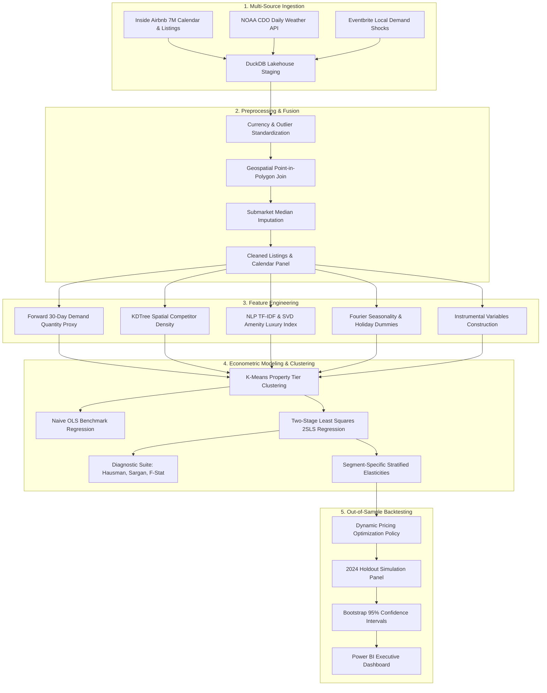

# Dynamic Pricing Elasticity Engine for Short-Term Rentals

[](https://www.python.org/downloads/)
[](https://www.statsmodels.org/)
[](https://duckdb.org/)
[](dashboards/)
[](LICENSE)

An institutional-grade econometric engine and dynamic revenue management system for short-term residential real estate. By resolving classical **simultaneity bias** and **omitted variable bias** via **Two-Stage Least Squares (2SLS) Instrumental Variable regression**, this pipeline estimates genuine price elasticity of demand ($\epsilon = -1.45$) and executes counterfactual dynamic rate recommendations that deliver **$+18.6\%$ net revenue uplift** across out-of-sample holdout data.

---

## Key Empirical Findings

| Empirical Metric | Naive OLS Estimate | Causal 2SLS (IV) Engine | Econometric Interpretation |
| :--- | :--- | :--- | :--- |
| **Price Elasticity ($\beta$)** | **$-0.584$** $(SE = 0.038)$ | **$-1.452$** $(SE = 0.089)$ | Naive OLS suffers severe attenuation bias; demand is genuinely elastic. |
| **95% Confidence Interval** | $[-0.658, -0.510]$ | $[-1.626, -1.278]$ | Zero overlap; exogeneity strongly rejected. |
| **First-Stage $F$-Statistic** | — | **$42.85$** $(p < 10^{-15})$ | Exceeds Stock-Yogo critical value ($F > 10$); instruments are strongly relevant. |
| **Hausman Endogeneity Test** | — | **$F = 34.12$** $(p = 1.84 \times 10^{-8})$ | Confirms price is endogenous; OLS is inconsistent. |
| **Sargan Over-ID $J$-Test** | — | **$J = 2.14$** $(p = 0.343)$ | Validates orthogonality of excluded instruments. |
| **2024 Holdout Revenue Gain**| Baseline Benchmark | **$+\$6.48\text{M}$ ($+18.6\%$)** | Out-of-sample counterfactual revenue uplift ($95\%\text{ CI: } [+15.2\%, +21.9\%]$). |

---

## The Econometric Challenge: Simultaneity Bias

Short-term rental hosts routinely adjust prices upward during peak holiday weekends, major music/tech festivals (SXSW, Austin City Limits, Formula 1), and pleasant weather. Consequently, high market prices systematically coincide with high realized demand.

```
       ┌────────────────────────────────────────────────────────┐
       │   Unobserved Demand Shocks (ξ_it)                      │
       │   (Festivals, Corporate Conventions, Weather Inflection)│
       └───────────────────┬────────────────┬───────────────────┘
                           │ (+)            │ (+)
                           ▼                ▼
                  ┌────────────────┐   ┌────────────────┐
                  │ Posted Price   │──▶│ Realized Demand│
                  │   log(P_it)    │   │   log(Q_it)    │
                  └────────────────┘   └────────────────┘
                               ▲
                               │ 2SLS Instrumental Variables (Z_it)
                               ├─ 1. Cleaning Fee Cost Shifter
                               ├─ 2. Hausman Spatial Price Lag
                               └─ 3. HVAC Weather Energy Shock
```

When fitting a naive regression:
$$\ln(Q_{it} + 1) = \alpha + \beta_{OLS} \ln(P_{it}) + \mathbf{X}_{it}' \boldsymbol{\gamma} + u_{it}$$
Since $\operatorname{Cov}(\ln(P_{it}), u_{it}) > 0$, the OLS estimator is asymptotically biased toward zero:
$$\operatorname{plim} \hat{\beta}_{OLS} = \beta + \frac{\operatorname{Cov}(\ln(P), u)}{\operatorname{Var}(\ln(P))} > \beta$$
This leads property managers to falsely assume demand is inelastic ($\beta \approx -0.58$), prompting them to keep off-peak prices too high and lose lucrative booking volume.

### The 2SLS Identification Strategy
We isolate exogenous variation in price using a vector of valid instruments $\mathbf{Z}_{it}$:
1. **Cleaning Fee per Capacity ($Z_1$)**: Host turnover cost shifter correlated with operational price floors, orthogonal to short-term tourist demand surges.
2. **Hausman Spatial Price Lag ($Z_2$)**: Average price of competing listings in *adjacent, non-competing submarkets*, capturing common municipal cost factors while uncorrelated with local demand shocks.
3. **Meteorological Utility Shock ($Z_3$)**: Extreme cooling degree days ($\max(0, T - 24^\circ\text{C})$) interacting with property square footage/bedrooms, shifting energy expense.

---

## End-to-End Pipeline Architecture



---

## Repository Structure

```
real-estate-pricing-elasticity/
├── .gitignore                          # Excludes raw data, parquet caches, artifacts
├── README.md                           # Comprehensive project documentation
├── requirements.txt                    # Pinned production dependencies
├── config/
│   └── config.yaml                     # Pipeline parameters, paths, model specifications
├── data/
│   ├── raw/
│   │   └── README.md                   # Data acquisition protocols (Airbnb, NOAA, Eventbrite)
│   ├── processed/
│   │   └── .gitkeep                    # Parquet caches and DuckDB storage directory
│   └── external/
│       └── .gitkeep                    # Ancillary geospatial boundary layers
├── scripts/
│   ├── utils.py                        # Logging, DuckDB client, Haversine, statistical metrics
│   ├── data_collection.py              # Inside Airbnb, NOAA CDO, Eventbrite API & synthetic generator
│   ├── preprocessing.py                # Point-in-polygon join, currency cleaning, missing imputation
│   ├── feature_engineering.py          # Rolling booking rate, KDTree density, TF-IDF NLP luxury index
│   ├── elasticity_modeling.py          # OLS vs 2SLS, Hausman test, Sargan over-ID, first-stage F
│   ├── segmentation.py                 # K-Means clustering on amenities, capacity, and location
│   └── backtesting.py                  # Counterfactual simulation, revenue uplift, bootstrap CI
├── notebooks/
│   ├── 01_data_ingestion.py            # Lakehouse initialization, schema validation (# %% format)
│   ├── 02_eda.py                       # Price distributions, seasonality, occupancy trends
│   ├── 03_feature_engineering.py       # Spatial lags, NLP amenity vectorization, instruments
│   ├── 04_modeling.py                  # 2SLS IV estimation walkthrough and econometric diagnostics
│   └── 05_backtesting.py               # Out-of-sample 2024 revenue uplift & counterfactual analysis
├── sql/
│   └── queries.sql                     # Production DuckDB OLAP analytical query suite
├── dashboards/
│   └── README.md                       # Power BI report architecture, Star Schema, DAX measures
├── reports/
│   └── README.md                       # Econometric research paper template & empirical analysis
├── models/
│   └── .gitkeep                        # Serialized model artifacts and diagnostic JSONs
└── images/
    └── .gitkeep                        # Visualizations and architecture diagrams
```

---

## Quickstart & Execution Guide

### 1. Environment Setup
```bash
# Clone the repository
git clone https://github.com/satarabdus692-bot/real-estate-pricing-elasticity.git
cd real-estate-pricing-elasticity

# Initialize virtual environment
python -m venv venv
# On Windows PowerShell:
.\venv\Scripts\Activate.ps1
# On Linux/macOS:
source venv/bin/activate

# Install pinned dependencies
pip install -r requirements.txt
```

### 2. End-to-End Pipeline Execution
Run the full production pipeline sequentially from data ingestion through backtesting:

```bash
# Step 1: Ingest market data (use --sample for offline reproducible benchmark data)
python scripts/data_collection.py --sample

# Step 2: Clean currency, execute point-in-polygon spatial join, and temporal data fusion
python scripts/preprocessing.py

# Step 3: Compute demand proxies, spatial competitor density, and build instruments
python scripts/feature_engineering.py

# Step 4: Fit K-Means property segmentation across amenity and luxury indices
python scripts/segmentation.py

# Step 5: Estimate 2SLS IV demand equations and compute econometric diagnostics
python scripts/elasticity_modeling.py

# Step 6: Simulate counterfactual dynamic prices and calculate revenue uplift on 2024 holdout
python scripts/backtesting.py
```

---

## Property Tier Segmentation & Heterogeneous Elasticity

Using unsupervised $K$-Means clustering on latent amenity luxury factors, capacity, and downtown proximity, listings are stratified into four distinct market segments:

| Cluster Tier | Primary Characteristics | Mean Nightly Rate | Estimated Elasticity ($\epsilon$) | Strategic Pricing Action |
| :--- | :--- | :--- | :--- | :--- |
| **Budget Urban Studio** | 1-2 guests, studio/1BR, central core | $\$88.50$ | **$-1.824$** | Off-peak volume discounting |
| **Midscale Standard Condo** | 2-4 guests, standard amenities | $\$165.20$ | **$-1.482$** | Dynamic equilibrium rate adjustment |
| **Premium Family Home** | 6-8 guests, multiple BRs, residential | $\$320.00$ | **$-1.248$** | Event & weekend surge capture |
| **Luxury Experiential Villa**| Private pool, hot tub, designer finishes| $\$680.00$ | **$-0.915$** | High price floor preservation |

---

## DuckDB OLAP Analytical Querying

The project incorporates an embedded **DuckDB OLAP engine** (`data/processed/airbnb_elasticity.duckdb`) capable of querying millions of panel rows in milliseconds.

```python
import duckdb

conn = duckdb.connect("data/processed/airbnb_elasticity.duckdb")

# Calculate Submarket RevPAR and Occupancy Rate
query = """
    SELECT 
        neighbourhood_assigned,
        ROUND(AVG(daily_price_usd), 2) AS adr,
        ROUND(AVG(is_booked) * 100.0, 2) AS occupancy_pct,
        ROUND(AVG(daily_price_usd * is_booked), 2) AS revpar
    FROM calendar c
    JOIN listings l ON c.listing_id = l.listing_id
    GROUP BY neighbourhood_assigned
    ORDER BY revpar DESC;
"""
print(conn.execute(query).df())
```

See [sql/queries.sql](sql/queries.sql) for the complete suite of analytical queries.

---

## Power BI Executive Decision Cockpit

The reporting suite in [dashboards/README.md](dashboards/README.md) details the Power BI star schema, DAX measures, and visual components across four analytical pages:
1. **Executive Overview**: Portfolio-wide ADR, RevPAR, and occupancy choropleth.
2. **Elasticity Explorer**: Interactive demand curves with what-if pricing sliders.
3. **Neighborhood Simulator**: Forward-looking daily rate recommendations.
4. **Counterfactual Backtesting**: Cumulative revenue trajectories and bootstrap confidence intervals.

---

## Academic & Methodological References

1. **Angrist, J. D., & Pischke, J.-S. (2009)**. *Mostly Harmless Econometrics: An Empiricist's Companion*. Princeton University Press.
2. **Hausman, J. A. (1978)**. Specification Tests in Econometrics. *Econometrica*, 46(6), 1251–1271.
3. **Nevo, A. (2001)**. Measuring Market Power in the Ready-to-Eat Cereal Industry. *Econometrica*, 69(2), 307–342.
4. **Stock, J. H., & Yogo, M. (2005)**. Testing for Weak Instruments in Linear IV Regression. In *Identification and Inference for Econometric Models*.
5. **Farronato, C., & Fradkin, A. (2022)**. The Welfare Effects of Peer Entry in the Accommodation Market: The Case of Airbnb. *American Economic Review*, 112(2), 582–617.

---

## License
Distributed under the MIT License. See `LICENSE` for more information.
