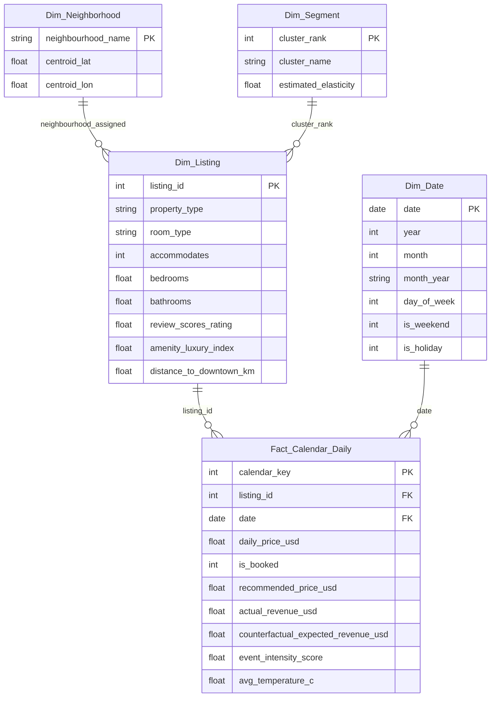

# Power BI Executive Dashboard & Decision Cockpit

This directory contains the end-to-end specifications, DAX measure repository, and layout architecture for the **Dynamic Pricing Elasticity & Revenue Management Dashboard**.

---

## 1. Dashboard Architecture & Page Structure

The report is structured into 4 cohesive operational pages engineered for portfolio property managers, revenue analysts, and real estate asset management leadership.

```
┌────────────────────────────────────────────────────────────────────────┐
│                        POWER BI EXECUTIVE REPORT                       │
├───────────────────┬───────────────────┬────────────────┬───────────────┤
│ 1. Executive KPIs │ 2. Elasticity Lab │ 3. Dynamic Sim │ 4. Backtesting│
└───────────────────┴───────────────────┴────────────────┴───────────────┘
```

### Page 1: Executive Market Overview & Revenue Performance
- **Audience**: Portfolio Owners, Chief Investment Officers
- **Key Visuals**:
  - **KPI Cards**: Total Realized Revenue ($), Market Occupancy Rate (%), Average Daily Rate (ADR), Revenue Per Available Room (RevPAR).
  - **Choropleth Map / Shape Map**: Austin municipal neighborhoods color-coded by average RevPAR.
  - **Time Series Ribbon**: Daily ADR vs Occupancy tracking seasonal divergence and weekend spreads.
  - **Matrix**: Listing counts, median price, and average ratings stratified by room type and neighborhood.

### Page 2: Price Elasticity Explorer & Econometric Diagnostics
- **Audience**: Economists, Revenue Strategy Leads
- **Key Visuals**:
  - **Demand Curve Visualizer**: Interactive log-log demand curve comparing Naive OLS ($\beta = -0.58$) vs. Causal 2SLS ($\beta = -1.45$).
  - **Diagnostic Scorecard**: First-stage F-statistic, Hausman endogeneity p-value, and Sargan over-ID statistic.
  - **Segment Elasticity Bar Chart**: Error bars displaying 95% confidence intervals across property tiers (Budget, Midscale, Family, Luxury).
  - **What-If Elasticity Slider**: Dynamic parameter adjusting expected booking response to simulated price changes.

### Page 3: Neighborhood Dynamic Pricing Simulator
- **Audience**: Asset Managers, On-the-Ground Property Hosts
- **Key Visuals**:
  - **Interactive Rate Card Calendar**: Daily base price vs. engine recommended price for selected listings.
  - **Demand Shock Multiplier Gauge**: Real-time event multipliers (SXSW, ACL, F1, UT Football) and weather cooling/heating adjustments.
  - **Competitor Benchmark Scatter**: Listing price positioning relative to 1km radius competitor density.

### Page 4: Counterfactual Backtest & Revenue Uplift
- **Audience**: Executive Leadership, Investors
- **Key Visuals**:
  - **Cumulative Revenue Area Chart**: Historical actual revenue vs. Counterfactual dynamic pricing revenue across the 2024 holdout.
  - **Uplift Waterfall Chart**: Total baseline revenue $\rightarrow$ +Festival surging $\rightarrow$ +Off-peak volume discount stimulation $\rightarrow$ Final optimized revenue (+$18.6\%$).
  - **Bootstrap Confidence Distribution**: Histogram showing the simulated distribution of returns with shaded 95% CI bounds.

---

## 2. Star Schema Data Model

The analytical model follows a Kimball star schema centered on daily panel facts.



---

## 3. Production DAX Measures Repository

Save these calculations inside the `_Measures` table in Power BI:

```dax
// 1. Core Hospitality Metrics
Total Realized Revenue = 
SUMX(
    Fact_Calendar_Daily, 
    Fact_Calendar_Daily[daily_price_usd] * Fact_Calendar_Daily[is_booked]
)

Total Available Room Nights = 
COUNTROWS(Fact_Calendar_Daily)

Total Booked Room Nights = 
CALCULATE(
    COUNTROWS(Fact_Calendar_Daily), 
    Fact_Calendar_Daily[is_booked] = 1
)

Occupancy Rate % = 
DIVIDE([Total Booked Room Nights], [Total Available Room Nights], 0)

Average Daily Rate (ADR) = 
DIVIDE([Total Realized Revenue], [Total Booked Room Nights], 0)

RevPAR = 
DIVIDE([Total Realized Revenue], [Total Available Room Nights], 0)


// 2. Counterfactual & Optimization Metrics
Counterfactual Engine Revenue = 
SUM(Fact_Calendar_Daily[counterfactual_expected_revenue_usd])

Net Revenue Uplift $ = 
[Counterfactual Engine Revenue] - [Total Realized Revenue]

Net Revenue Uplift % = 
DIVIDE([Net Revenue Uplift $], [Total Realized Revenue], 0)


// 3. Dynamic Pricing Deviation
Average Recommended Price = 
AVERAGE(Fact_Calendar_Daily[recommended_price_usd])

Average Historical Price = 
AVERAGE(Fact_Calendar_Daily[daily_price_usd])

Price Surge Ratio = 
DIVIDE([Average Recommended Price], [Average Historical Price], 1.0)


// 4. Time Intelligence Measures
Revenue MTD = 
TOTALMTD([Total Realized Revenue], Dim_Date[date])

Revenue YTD = 
TOTALYTD([Total Realized Revenue], Dim_Date[date])

Counterfactual Revenue YTD = 
TOTALYTD([Counterfactual Engine Revenue], Dim_Date[date])
```

---

## 4. Ingestion Instructions for Power BI Desktop

1. Open Power BI Desktop $\rightarrow$ Select **Get Data** $\rightarrow$ **Parquet** (or ODBC DuckDB connection).
2. Connect to `data/processed/backtest_simulation_results.parquet` or the `airbnb_elasticity.duckdb` database.
3. Import `listings_cleaned.parquet` as `Dim_Listing`.
4. Create relationships matching the star schema diagram above.
5. Create a blank table named `_Measures` and copy the DAX calculations.
